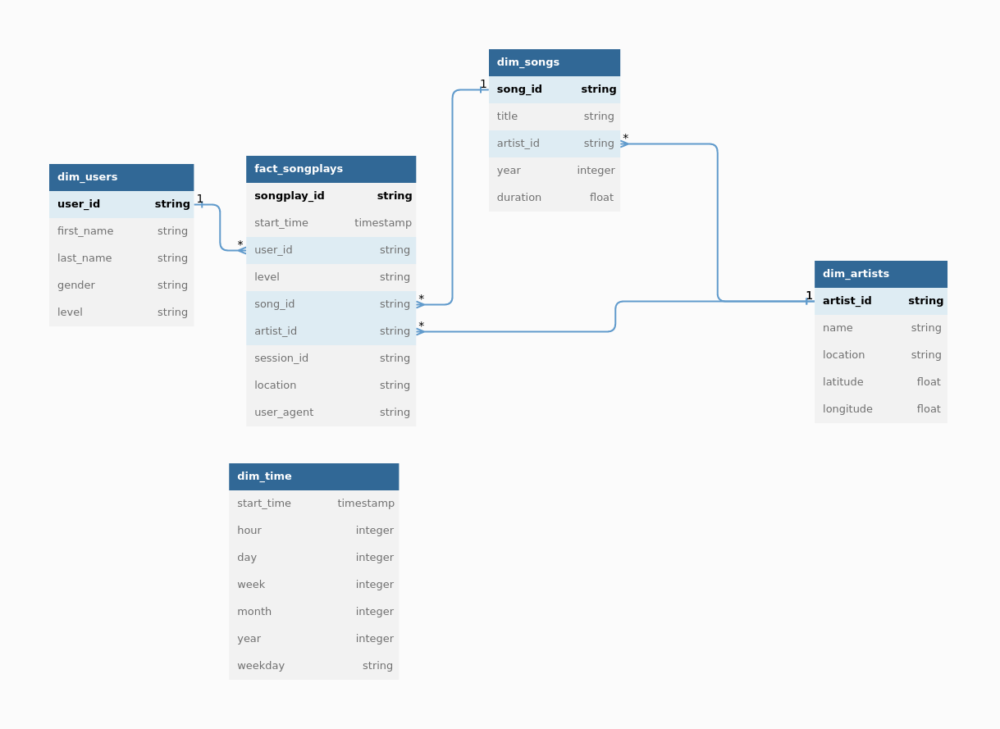

# Project 1: Data Modeling with PostgreSQL

In this project, we will model the data of a fictional music-streaming service called Sparkify. 

Diagram for the final model:

https://dbdiagram.io/embed/633314907b3d2034ffcc20e5



## Preparation

This section will walk you through the steps to prepare a PostgreSQL datbase so you can run this modeling project in Linux.

If you use the online workspace provided by Udacity, you can skip this sections. 

### Install PostgreSQL
Follow the instruction here to install PostgreSQL on Linux: https://www.postgresql.org/download/linux/ubuntu/

### Prepare databases
The `create_tables.py` script provided by Udacity will first connect to a default database called `studentdb`, using username `student`. Since we are running PostgreSQL locally, we will need to create the database and the user ourselves. If not, the default connection cannot be initiated.

1. In your terminal, change to `postgres` user:
    ```bash
    sudo su - postgres
    ```
    Provide your user password when prompted. 

2. Once you have logged into the postgres user, run `psql`. Your promt will now look like this:
    ```bash
    postgres=# 
    ```

3. Create the `student` user with `createdb` permission:
    ```sql
    create user student encrypted password 'student' createdb;
    ```

4. Create the `studentdb` database and set `student` as the owner:
    ```sql
    create database studentdb owner student;
    ```

And now you are done.

## Dependencies
This project is written to be run in Udacity's environment which requires:
- Python 3.6.3
- psycopg2-binary 2.7.4
- pandas 0.23.3

If you do not have Python 3.6.3, you should install it via pyenv.

Assuming that you already have pyenv installed, run the following:

```bash
pyenv install 3.6.3
```

On PopOS, you may encounter this error: `python-build: line xxx: xxxx Segmentation fault`. If that's the case, run the following:

```bash
sudo apt install clang -y;
CC=clang pyenv install 3.6.3;
```

Then cd in to the project folder, run
```bash
pyenv local 3.6.3
```
to set the project folder's python version to Python 3.6.3

To install required packages:
```bash
pip3 install -r requirements.txt;
```

## Run the project

Run the following commands in the terminal:

```bash
python3 create_tables.py;
python3 etl.py;

```