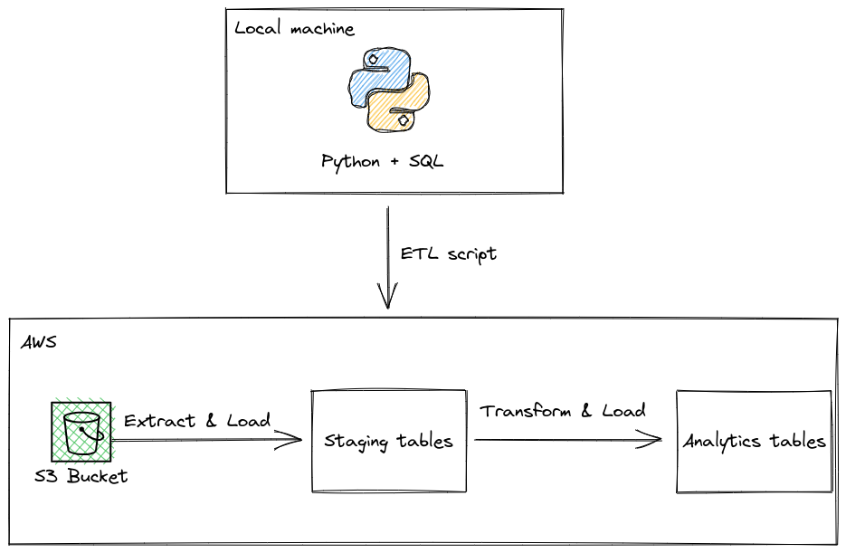
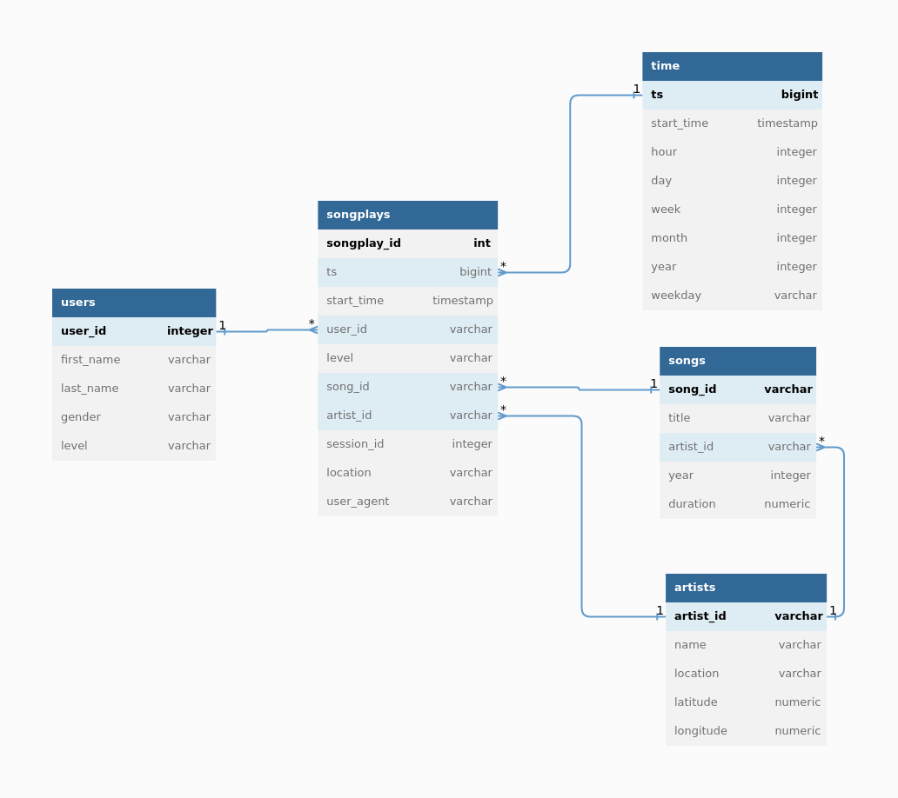

# Project 3: Data Warehousing with AWS

In this project, we will build the data warehouse for a fictional music-streaming service called Sparkify. 

## Architecture



Diagram for the final model:



## Model optimization

In the model, a few optimization practices were applied:
- `songplays` table: Use `start_time` field as both `DISTKEY` and `SORTKEY`, because this is a very large table, and the rows are quite evenly distributed across timestamps/dates
- Use `DISTSTYLE ALL` for all look up tables (`artists`, `songs`, `users`, `time`) because these tables are small.
- Specify foreign key constraints wherever applicable so the query optimizer can generate more efficient query plan.


## Installation
This project is written to be run in Udacity's environment which requires:
- Python 3.6.3
- psycopg2-binary 2.7.4


### Install Python
If you do not have Python 3.6.3, you should install it via pyenv.

Assuming that you already have pyenv installed, run the following:

```bash
pyenv install 3.6.3
```

On PopOS, you may encounter this error: `python-build: line xxx: xxxx Segmentation fault`. If that's the case, run the following:

```bash
sudo apt install clang -y;
CC=clang pyenv install 3.6.3;
```
(Reference: https://github.com/pyenv/pyenv/issues/2239)


Then cd in to the project folder, run this to set the project's python version to Python 3.6.3
```bash
pyenv local 3.6.3
```

### Install required packages:

```bash
pip3 install -r requirements.txt;
```

## Run the project

```bash
python3 create_tables.py;
python3 etl.py;
```