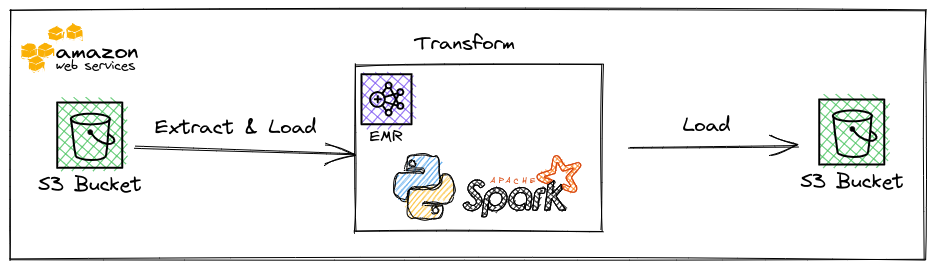

# Project 4: Data Lake with AWS EMR, Spark & S3

In this project, we will build a data lake structure for a fictional music-streaming service called Sparkify. 


## Architecture



Diagram for the final model:


## Model optimization

In the model, a few optimization practices were applied:
- `songplays` table: partition by `year` and `month`, because this is a very large table, and typically when querying fact tables like this, users will want to filter by time period.
- `time` table: partition by `year` and `month`


## Requirements

- [AWS CLI tool](https://docs.aws.amazon.com/cli/latest/userguide/getting-started-install.html): to manage EMR clusters
- A key pair generated in AWS, with the `.pem` file available locally.
- Credentials to access S3 data: AWS_ACCESS_KEY_ID, AWS_SECRET_ACCESS_KEY, AWS_SESSION_TOKEN
- Python 3.7.14
- [pyenv](https://github.com/pyenv/pyenv#installation) to manage python version & virtual environment
- [Java](https://docs.oracle.com/cd/E19509-01/820-3208/inst_cli_jdk_javahome_t/) is also needed to run spark. Please follow the official guide to install Java and set JAVA_HOME variable.


## Installation

- `make install-aws-cli`: Install the AWS CLI if you don't have it
- `make prepare-environment`: Install Python 3.7.14 using `pyenv`, set the local folder's python version, and install other required packages to this version's environment.


## Configurations:

- After installing the AWS CLI tool, you will need to configure AWS credentials for your machine. Please follow AWS's official [Quick Setup guide](https://docs.aws.amazon.com/cli/latest/userguide/getting-started-quickstart.html).

- If you want to create EMR via the CLI using the `make create-emr-cluster` command, first you will need to set the following environment variables:
    - `export AWS_KEY_NAME=<name of your key pairs>`
    - `export AWS_SUBNET_ID=<ID of one of your subnets>`

- ETL configurations:
    - `configs/config.cfg`: This file stores the paths to read & write data. Replace the `OUTPUT_PATH` with your own S3 bucket's URI. 
    - `credentials/cred.cfg`: This file stores the AWS credentials needed for EMR to access data in S3.


## Run the project

### Run locally
1. `make prepare-environment`: to prepare the local environment
2. Update the `configs/config.cfg` file with the paths to your local data
3. `make build-etl-dependencies` to build the dependency zip file for the ETL job
4. `make run-etl` to run the ETL job


### Run on EMR

1. Create an EMR cluster either via AWS Web UI or using the CLI. If you want to create EMR via the CLI tool, run `make create-emr`. To monitor the creation progress, you can also use `make list-active-clusters`.
2. Once the cluster is ready, ssh into the EMR cluster
    ```bash
    ssh -i path/to/keyfile.pem hadoop@<EMR Master public DNS>
    ```
3. Once logged in, create an `etl` folder in the EMR cluster
    ```bash
    mkdir etl
    ```
4. From your local machine, use `scp` to copy project files to the cluster
    ```bash
    scp -i path/to/keyfile.pem -r * hadoop@<EMR Master public DNS>:~/etl
    ```
5. `make build-etl-dependencies` to build the dependency zip file for the ETL job.
6. `make run-etl` to run the ETL job.

