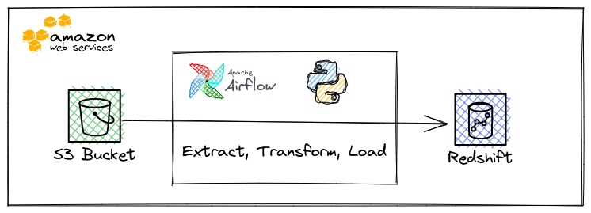

# Project 5: Data Pipeline with Airflow

In this project, we will build an Airflow pipeline for a fictional music-streaming service called Sparkify.
This repo is meant to be run on Udacity's provided infrastructure, so there won't be any guide on how to set up Airflow.

## Architecture

## Pipeline description

Airflow DAG diagram:

In this pipeline, we will:
- Copy sample sparkify data from S3 to staging tables in Redshift
- Transform staging tables into dim & fact tables
- Run data tests on dim & fact tables

## Configurations:

For the DAG to run:
- Create a Redshift cluster using Udacity's provided AWS account in the `us-west-2` region. Make sure to enable public access.
- After the cluster is available, create an IAM role with access to S3, and associate that IAM role with the cluster.
- Create connections in Airflow:
    - `redshift`: Use the cluster's info to create a Redshift connection in Udacity's Airflow server, with ID `redshift`.
    - `aws_credentials`: Get the **IAM role's ARN** and create an Amazon Web Service connection in the Airflow server, with ID `aws_credentials`. Enter the ARN into both login and password field.

> WARNING: Highly recommend using IAM role authentication method instead of AWS access key, because the authentication parameter will be inserted to the S3 to Redshift `COPY` sql, and the secret will be exposed in the log.
